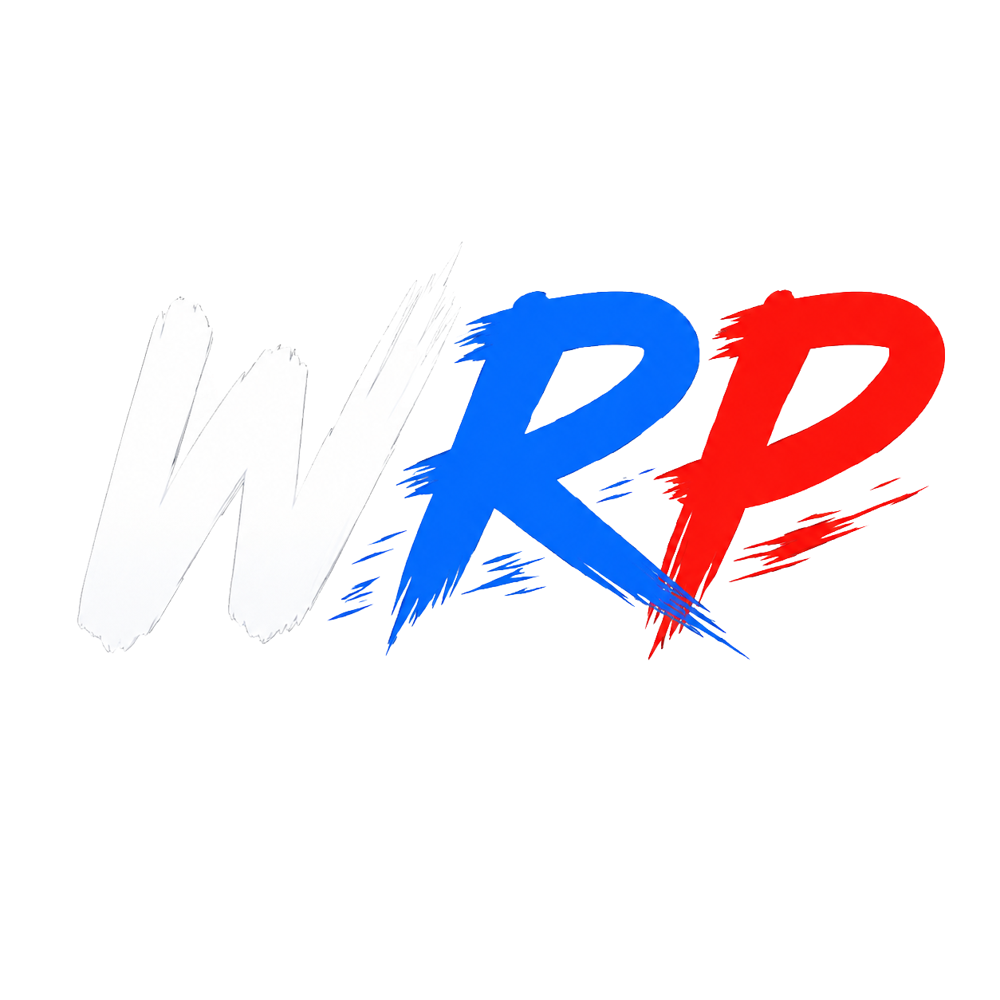
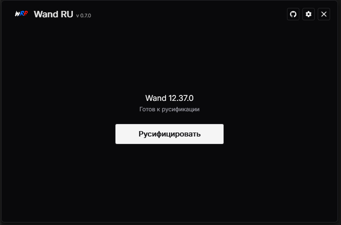
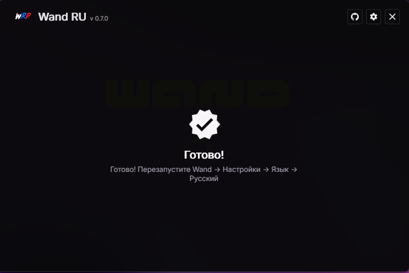
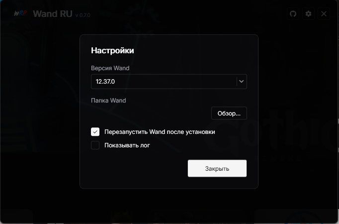

<div align="center">



# Wand RU Patcher (WRP)

**Русификатор приложения [Wand](https://www.wandpc.com/) для пользователей из СНГ.**

Установка в один клик: находит Wand, добавляет русский язык и включает его.
Полностью локально, без интернета.

</div>

---

> [!WARNING]
> **У проекта НЕТ официальных видео-туториалов, гайдов и готовых `.exe` для скачивания со сторонних сайтов, кроме playground.**
> Единственные источники - это репозиторий и playground. Собирайте `.exe` сами из исходников (см. ниже), релизов
> этого репозитория или качайте с playground. Не скачивайте `.exe` из описаний YouTube, случайных зеркал, Discord-вложений - там бывают
> вирусы под именем проекта. Мы не отвечаем за сторонние сборки.

## 🇷🇺 Что делает

- 🔎 **Автопоиск Wand** - сам находит установленную копию (или указывайте папку вручную).
- 🈴 **Полная русификация** - переводит интерфейс Wand на русский (2273 строки) и добавляет `Русский` в выбор языка.
- 🎮 **Перевод имён читов** - названия читов трейнеров (`Unlimited Health` → `Бесконечное здоровье`,
  `Damage Multiplier` → `Множитель урона`) переводятся на лету. Два режима — см. ниже.
- ↩️ **Откаты** - перед патчем делает бэкап, откат в один клик.
- ⚙️ **Настройки** - выбор версии Wand, авто-перезапуск, показ/экспорт лога, режим перевода читов, кэш.
- 🔔 **Уведомление об обновлениях** - при выходе новой версии WRP в шапке появляется баннер;
  клик открывает страницу релиза на GitHub. Авто-обновления нет - вы сами решаете, что ставить.

## 🎮 Перевод имён читов: локально или + интернет

При установке два варианта:

- **Русифицировать локально** (по умолчанию, полностью офлайн) - переводит имена читов встроенным
  словарём + морфологическими шаблонами (род, падежи, склейка составных имён). Без интернета.
  На реальных трейнерах **62 игр**: **~51%** имён с верной грамматикой (в геймерских жанрах выше —
  гонки 85%, экшн 68%, космос 65%, выживание 59%, шутеры 55%). Остаток - жаргон отдельных игр,
  пополняется по мере запросов.
  > 💯 Плюс **точные словари для отдельных игр** (`WAND_RU/renderer/games/`) - у этих игр переведены
  > **все** имена читов вручную, офлайн. Сейчас покрыто **16 игр** (Fallout 4, Hearts of Iron IV,
  > Victoria 3, Medieval Dynasty, Mortal Kombat 11/1 и др.), список растёт по запросам - открывайте issue.
- **Русифицировать локально + интернет** - то же, плюс всё непокрытое словарём допереводится онлайн
  и кэшируется. Переводит практически всё. Провайдеры бесплатные и без ключей: **Google Translate**,
  при его сбое - **MyMemory**, при недоступности обоих - офлайн-фолбэк (имя останется на английском
  и переведётся в следующий раз). Кэш можно очистить в настройках, там же виден его размер.

Режим можно сменить в настройках в любой момент (применится после перезапуска Wand). Онлайн-перевод
работает **внутри самого Wand** - наш установщик держать открытым не нужно, нужен лишь запущенный
Wand и интернет.

## 👾 Это безопасно?

Да. Проект **полностью открыт** - код можно проверить. Сам установщик работает **локально**: правит
файлы клиента Wand на вашем компьютере (`app.asar`) и сам никуда данные не шлёт. Оригинальные файлы
сохраняются в бэкап - установку всегда можно откатить.

Единственное сетевое исключение - **опциональный** режим «локально + интернет»: если вы его включите,
Wand будет отправлять непереведённые имена читов в онлайн-переводчик (Google Translate, при сбое -
MyMemory). По умолчанию режим **выключен** - тогда всё строго локально, без сетевых запросов.

## 🚀 Как пользоваться

### Шаг 1. Получите `WandRuInstaller.exe`

Любым из способов:

**A. Скачать из [релизов](../../releases) этого репозитория** (рекомендуется):
- `WandRuInstaller.exe` - работает «из коробки», ничего ставить не надо (~130 МБ).
- `WandRuInstaller-small.exe` - компактный (~2.4 МБ), нужен установленный
  [.NET 9 Desktop Runtime](https://dotnet.microsoft.com/download/dotnet/9.0).

**B. Собрать через GitHub Actions** (ничего ставить не нужно):
1. Войдите в GitHub и сделайте **Fork** этого репозитория.
2. В своём форке откройте вкладку **Actions** и включите рабочие процессы, если GitHub попросит.
3. Выберите рабочий процесс **Build executable**.
4. Нажмите **Run workflow**, оставьте ветку по умолчанию и запустите.
5. Дождитесь завершения, откройте запуск и скачайте артефакт **WandRuInstaller**.
6. Распакуйте архив - внутри `WandRuInstaller.exe`.

**C. Собрать локально** - см. [«Сборка из исходников»](#-сборка-из-исходников).

### Шаг 2. Русифицируйте

1. Запустите `WandRuInstaller.exe`.
2. Установщик найдёт Wand → нажмите **«Русифицировать»**.
3. Дождитесь **«Готово»** и перезапустите Wand.
4. В Wand: **Настройки → Язык → Русский**.

> Если Wand запущен - закройте его перед установкой (или включите в настройках «Перезапустить Wand после установки»,
> тогда установщик закроет и снова откроет его сам).

### Откат

Запустите установщик ещё раз и нажмите **«Откатить»** - вернутся оригинальные файлы Wand.

## 🛠️ Сборка из исходников

**Требования:**
- Windows 10/11
- [.NET 9 SDK](https://dotnet.microsoft.com/download/dotnet/9.0)

**Сборка:**
```cmd
cd WAND_RU
build.bat               :: обычная сборка
build.bat -Test         :: сборка + тесты
build.bat -Publish      :: самодостаточный .exe (~130-150 МБ, .NET внутри - ничего ставить не надо)
build.bat -PublishSmall :: компактный .exe (~2.4 МБ, нужен .NET 9 Desktop Runtime на машине)
```
- `-Publish` → `WAND_RU\publish\WandRuInstaller.exe` (один файл, работает у всех «из коробки»).
- `-PublishSmall` → `WAND_RU\publish-small\WandRuInstaller.exe` (~2.4 МБ, но на машине должен стоять
  [.NET 9 Desktop Runtime](https://dotnet.microsoft.com/download/dotnet/9.0)).

> Почему `-Publish` такой большой: он вшивает весь .NET-рантайм в exe. `-PublishSmall` рантайм не вшивает —
> отсюда ~2.4 МБ, но требует установленный .NET 9 Desktop Runtime. WPF нельзя обрезать (trimming), поэтому
> «золотой середины» между этими двумя нет.

## ❓ Q&A

- **Нужен ли Node.js / что-то ещё?**
  Нет. Установщик самодостаточный, всё делает нативно.
- **Почему Windows Defender / SmartScreen ругается на мою сборку?**
  Артефакт неподписанный и редкий - Windows может предупреждать даже для честной сборки из исходников.
  Проверьте код, соберите сами, запускайте только то, что собрали.
- **Отправляет ли программа куда-то данные?**
  По умолчанию нет - всё локально. Только если вы сами включите режим «локально + интернет»,
  Wand будет слать имена читов в онлайн-переводчик (Google/MyMemory). Сам установщик данные не шлёт никогда.
- **Нужно ли держать установщик открытым для онлайн-перевода?**
  Нет. Хук вшивается в файлы Wand, перевод работает внутри Wand. Нужен лишь запущенный Wand и интернет.
- **Обновил Wand - русский пропал?**
  После крупного обновления Wand просто запустите установщик заново и нажмите «Русифицировать».
- **Как обновить сам WRP?**
  При выходе новой версии в шапке установщика появится баннер «Доступна v…» - клик откроет страницу
  релиза, скачайте новый `.exe` и замените старый. Автоматически ничего не ставится.
- **В моей игре читы переведены не все / коряво?**
  Откройте issue с названием игры - добавим её в точные словари (все имена вручную, 100%).

## 🖼️ Скриншоты

<div align="center">





</div>

## 🧩 Как это устроено

- **Движок** - нативный C# (.NET 9): распаковка `app.asar` через AsarSharp, наложение перевода из
  `ru-overrides.json`, регистрация локали `ru-RU` в JS-бандлах, обратная упаковка, бэкап/манифест.
- **Перевод читов** - в `app.asar` вшивается renderer-скрипт (`cheat-hook.js`): перехватывает ответы
  трейнера, переводит имена читов офлайн-словарём, а в онлайн-режиме допереводит остаток (Google →
  MyMemory) с локальным кэшем. Словарь и движок - JS, генерируются из одного источника. Приоритет перевода:
  точный per-game словарь (`renderer/games/<gameId>.json`) → офлайн-движок → онлайн-MT.
- **UI** - WPF, MVVM.

## 🙏 Благодарности

Идея обхода ограничения и часть кода (asar-инструменты `AsarSharp`, UI-стиль) взяты из проекта
**[Wand-Enhancer](https://gitlab.com/kitbyte/wand-enhancer)** (© kitbyte, Apache-2.0). Респект ребятам за
благое дело!

## 📜 Лицензия

См. файл [LICENSE](LICENSE). Вендоренные компоненты из Wand-Enhancer - под Apache-2.0.

---

> **Дисклеймер:** проект - сторонний инструмент для образовательных целей и локальной русификации интерфейса.
> Не распространяет проприетарный код и не обходит серверные проверки. Все изменения выполняются локально.

<div align="center">

Сделано с любовью **by LockBB1** ❤️
Поставьте ⭐, если WRP помог вам!

</div>
